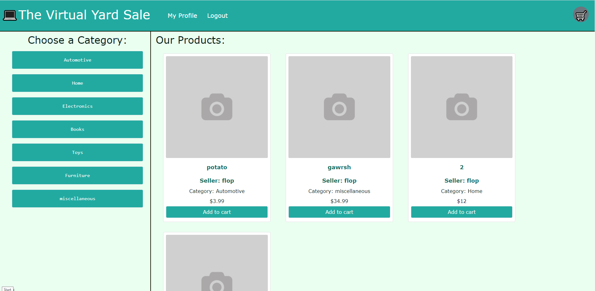

# The Virtual Yard Sale


## Description:<br>
This full stack web application is designed as a platform for those who are trying to get rid of unwanted items while making a profit or those who enjoy thrifting around for gems. In this application you can create a login, make product postings, follow sellers you like, add items to your cart and checkout! the checkout feature is only for testing of course though.<br><br>
Right now This application is still in a very alpha stage and many more features will be added soon, such as, ratings, reviews, and in-app messaging, so that users can share any questions about products with their seller!<br><br>


## Technologies used:

* Javascript
* Node.js
* HTML
* CSS
* Mongoose/MongoDB
* React
* Apollo
* Graphql
* Redux
* Bootstrap 

<br><br>

## Usage:

In the root directory in your command line run the command
```
npm i
```
followed by the command
```
npm i -D concurrently
```

To install all necessary dependencies. then run
```
npm run seed
```
 To seed the data base with the proper categories. (feel free to add any categories you'd like in config/seeds.js!) Finally, to start your local server for local testing run the command
 ```
 npm start
 ```
 and You can find the local page at http://localhost:3000/ in your browser!
 <br><br>
Alternatively, you can checkout the deployed site at the link below!

https://vysale.herokuapp.com/
<br><br>

## Preview:



## License:

This project is licensed under the MIT license.
<br><br>

## Questions:

If you have any questions about the repo, open an issue or contact me directly at Jespi116@fiu.edu. you can find more of my work at [Jespi116](https://github.com/Jespi116)